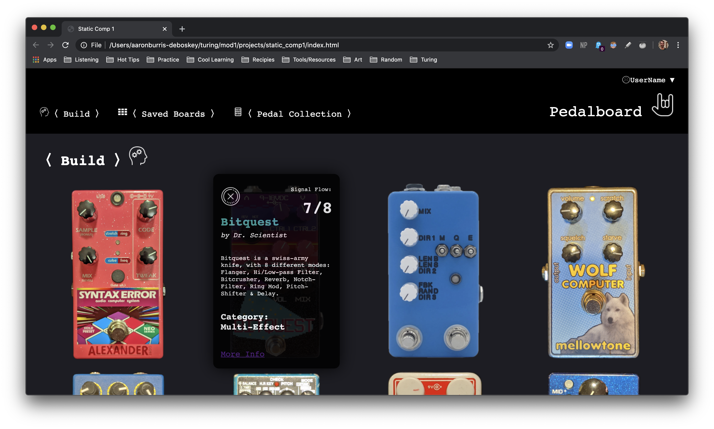
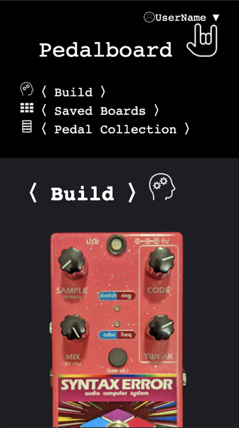

# abd-comp-challenge-1
 This is a static site called "Pedalboard" designed for users of guitar effects pedals to create mock pedalboards with effects pedals that they own or are interested in purchasing.

### If this were functional, users would be able to:

* Add pedals that they own or are interested in owning to a virtual collection in their user-profile.

* Add pedals from their collection to the "build" page, where they can try out different pedal configurations and see information about each device.

* Save pedalboards that they like to their profile for reference later.

Each pedal shows up as an image, and an information card about that pedal is displayed when a user hovers over the image.

### Information cards include:

* A button to delete the pedal from the current board.
* A fraction that depicts what order of the signal flow each pedal is in.
* The name of each pedal, and company that produces it.
* A brief description of the character of each pedal.
* The category of each effect.
* A link to the manufacturers website for more information.

### Below is the original comp that this was based on:

### Here is Pedalboard main view for comparison:

### And with an information card showing:

### As we re-size the window, the website responds:

 
#### This page can be seen in Github Pages deployment [Here](https://abdeboskey.github.io/abd-comp-challenge-1/)
